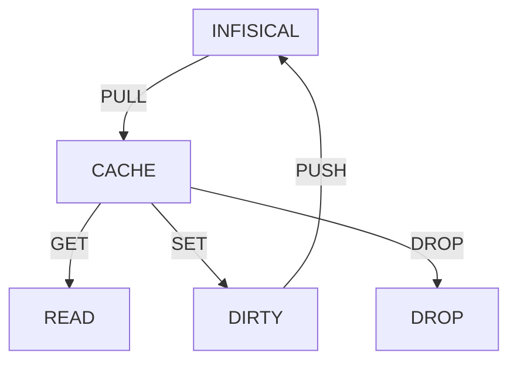
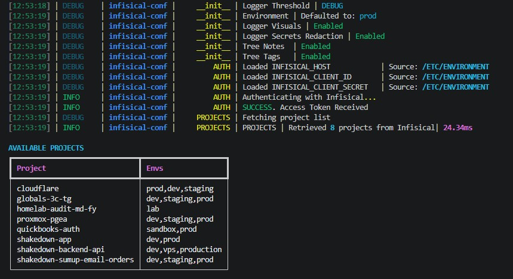
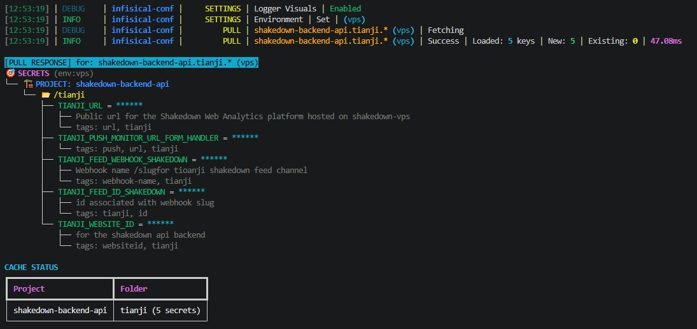
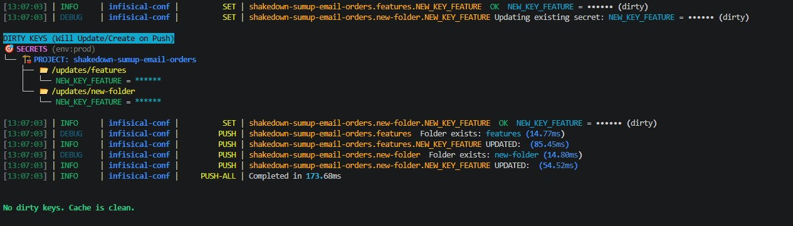

# infisical-conf
  
A local configuration cache for Infisical Secrets.  
Python methods for **pulling, caching, editing, retrieving, validating and pushing** using a clean workflow.    
Fetch Secrets from Infisical Secrets Manager
Create configuration objects in python scripts. 
Working on a `projects.folder.secret (environment)` hierarchy.  

This project wraps the official `infisical_sdk` with:

- **local hierarchical cache**
- **wildcard pull/drop/get**
- **explicit set/push**  
- **dirty‑tracking** for updates to secrets and new secrets within the local cache
- **automatic folder creation** within allowed projects in Infisical
- **strict notation validation** project.folder.secret (env)
- **visual diagnostics** (Rich tables & trees)
- **clean logging layer** with aligned columns
- **secure logging layer** with secret redaction to prevent leakage into logs

Designed for reproducible, scriptable, configuration workflows.

## Motivation
- Single source of truth for Python Secrets in a Homelab environment.  
- Simplify access to Secrets and avoiding code bloat in scripts.  
- Consistent approach to managing Secrets in code.  
- pip installable package   
- Easy to use and remember methods.   

## Security Considerations
- Built for use in development environments - not claiming to be enterprise grade - don't use unless it's function and purpose is understood.    
- Authenticated using a Machine Identity (Client ID + Client Secret).   
- No unrestricted access to the Infisical workspace - access to content strictly defined in the authenticated identity.  
- Whatever the client can access is exactly the same set of secrets, folders, and environments accesible to a user in the UI using same credentials. 
- No hidden elevation, no additional scope, and no bypass of Infisical’s RBAC model.  
- The local cache is in-memory - never written to disk or otherwise persisted - exists only for the lifetime of the process.  
- Logging can be redacted using keywords at startup so no values ever recorded in logs.
- Pushes to the Infisical instance can be disabled at startup.  

## Concepts

### Cache Lifecycle (Summary)
Builds an in‑memory cache of secrets.  All ops work against this cache, making the workflow predictable and safe.    




### Notation & Wildcard Hierarchy 
**Valid**
```
project.folder.key
project.folder.*
project.*.*
```
**Invalid**
```
*.folder.*
*.*.secret
project.*.secret
```

### PULL METHOD
- Fetch secrets (with values) from Infisical and store them in local cache.  
- Scope is selected using wildcard hierarchy.

### DROP METHOD
- Remove secrets from the local cache.  
- Scope is selected using wildcard hierarchy.  
- Does not delete anything in Infisical.
- Optional DROP-ALL method.  


### GET METHOD 
- Select Secrets to read from the cache and return them as response object.  
- Scope is selected using wildcard hierarchy.    
- Returns automatically derived type‑cast Python values (noting Infisical stores everything as a string).  
    - If multiple Secrets and/or multiple folders selected -  a structured dict is returned  
    - If a single Secret is selected - its type casted value is returned  

### SET METHOD 
- Modify or create a secret in the cache. 
- Atomic. Can only change one Secret at a time. Requires fully qualified project.folder.SECRET 
- Any Secret that is updated gets marked as 'dirty' (changed)
- Nothing is pushed yet - the change exists only in the local cache

### PUSH METHOD   
- Secrets marked 'Dirty' are updated in Infisical 
- Creates or updates secrets in Infisical based on what changed in the cache.
- Creates folders as required in Infisical for available Projects. 
- Restricted from creating a new Project with Folders in Infisical
- Clears dirty flags after success. 


## Quickstart

### Setup in Infisical
Assumes you have... 
- An accesible instance of Infisical and you know its `url`.
- Setup a `Machine identity` with an `Auth Method` that has provided `Client ID` and `Client Secret`  
- Setup RBAC controls ie added `Machine Identity` to the `projects` you wish to access etc.   
- You will not be able to access projects without doing this

### Environment Variables

The manager requires the Infisical instance url and Machine Identity credentials as Environment Variables 
 ```
INFISICAL_HOST=http(s)://BaseURL
INFISICAL_CLIENT_ID=<from Machine Identity in Infisical>
INFISICAL_CLIENT_SECRET=<from Machine Identity in Infisical>
 ```
 These are picked up from any of....  
-   system environment
-   `.env` file
-   `/etc/environment  

### Instantiation

``` python
pip install infisical-conf

from infisical_conf import InfisicalManager

manager = InfisicalManager(log_level=DEBUG, redact=False, visuals=True, readonly=False )
```

**Keywords**  
log_level = DEBUG / INFO / WARNING / ERROR  / CRITICAL  

redact  = True/False  
If True, ensures no values are recorded in logs  

visuals = True/False   
If True, the console log will show helpful visual clues about the status of cache including the Cache Tree, Dirty Tree and Project Table.  

readonly = True/False   
If True prevents any updates on Infisical (inhibits push features) - assuming these are allowed anyway by the Machine Identity credentials   


### Usage  
Somme of the main methods that can be used - assumes the Infisicalmanager has been instantiated.  

``` python

manager.set_env('prod')

# Load into Cache
manager.pull("project.folder.*")        # Secrets from project in specified folder (must exist)
manager.pull("project.*.*")             # Everything in project (must exist) - all folders added into cache
manager.pull("project.folder.SECRET")   # One Secret from specific project and folder (must exist)

# Get a Type Casted Configuration Dict  
response = manager.get("cloudflare.tokens.*")  # Return all secrets in tokens folder as a typecast dict
# response = {project:{folder:{secret:value,,}}}

# Get the Type Casted Value for a Single Secret
value = manager.get("project.folder.SECRET")
print(value)

# Update or Create a Secret
manager.set_secret("orders.features.ENABLE_LOG", True) # Change value of ENABLE_LOG to True

# Push 'Dirty' (changed) 
manager.push("orders.features.ENABLE_LOG") # Push a single changed Secret to Infisical
manager.push_all()                         # Push Anything that has changed in the cache to Infisical

```

### Cache Operations  
Methods to manipulate the cache - assumes Infisicalmanager has been instantiated.  

``` python
# Clear / Drop the whole cache 
manager.clear()

# Drop All Folders in a specific project
manager.drop("project.*.*" )

# Drop a specific folder in a project
manager.drop("project.folder.*" )

# Drop a specific Secret
manager.drop("project.folder.SECRET" )
```


### Dynamic Settings  
These settings, which change behaviour, can be applied dynamically within your script 

``` python

# Set the default environment for all pull/get/set/push operations
manager.set_env("prod")

# Enable or disable visual diagnostics (tables, trees, etc.)
manager.set_visuals(True)      # or False

# Enable or disable Secrets Tags in tree visualisations
manager.set_tree_tags(True)    # or False

# Enable or disable Secrets Notes in tree visualisations
manager.set_tree_tags(True)    # or False

```
### Visualisations  
Visualisations will automatically be displayed in the console if visuals=True.   
If required they can be called discretely after a cache changing operation.  
For example. 

``` python
# Tree Visualisation 
# Displays a full hierarchical tree of secrets for the last pull response.
manager.pull("my-project.*.*" )
manager.visual_tree_dynamic()

# Cache Visualisation
# Shows a two‑column summary table of what’s currently in the cache.
manager.cache_status()

# Projects Table
# Displays a table of available projects in Infisical and their environments.
manager.projects_table(manager._project_meta_cache)

# Dirty Tree
# Shows a tree of pending updates and new secrets.
manager.show_dirty_tree()

```

## Usage Scenarios  
### 1) Bulk Static Config Load   
In this scenario, an entire configuration object is pulled and fetched at program startup.  
This is then passed into the program for wherever this static config is required.  
The cache can effectively be dropped / cleared after the fetch.  
No further interaction with the cache or infisical is then expected.
```python
from infisical_conf import InfisicalManager

mgr    = InfisicalManager(log_level=DEBUG, redact=False, visuals=True )
config = mgr.pull("myproj.backend.*")
mgr.cache_clear()
```


### 2) Application Mode  - Dynamic Flags  
As per 1) but using feature-like flags that represent dynamic switches in the program, controlling behaviours. e.g enable/disable flags.   
When dynamically changed by a user, they can be persisted in Infisical.  

``` python
from infisical_conf import InfisicalManager, INFO

# At app startup
flags = InfisicalManager(log_level=INFO, redact=True, visuals=False)
flags.set_env("prod")
flags.pull('myproj.flags.*')

## User toggles a flag
feature1_key   = 'myproj.flags.FEATURE1'
feature1_state = flags.get(feature1_key)
new_state      = "enabled" if feature1_state == "disabled" else "disabled"
flags.set_secret(feature1_key, new_state)
flags.push()
```
### 3) Django - Feature Flags
Create the manager once, not per request.
 
``` python
# myapp/apps.py:
# This loads all flags at startup and caches them.
from django.apps import AppConfig
from infisical_conf import InfisicalManager, INFO


class MyAppConfig(AppConfig):
    name = "myapp"

    def ready(self):
        from . import feature_flags

        feature_flags.flags = InfisicalManager(log_level=INFO,redact=True,visuals=False)

        feature_flags.flags.set_env("prod")
        feature_flags.flags.pull("myproj.flags.*")


```
Feature-flag Helper Module
``` python
# myapp/feature_flags.py
flags = None


def is_enabled(flag_name):
    value = flags.get(f"myproj.flags.{flag_name}")
    return value in ("on", "enabled", "true", "1")


def set_flag(flag_name, new_state):
    flags.set_secret(f"myproj.flags.{flag_name}", new_state)


def persist(): flags.push()

```

In the views.py
``` python
# views.py
from django.http import JsonResponse
from .feature_flags import is_enabled, set_flag, persist


def toggle_checkout(request):
    flag = "NEW_CHECKOUT_FLOW"

    current = is_enabled(flag)
    new_state = "disabled" if current else "enabled"

    set_flag(flag, new_state)
    persist()

    return JsonResponse({"flag": flag, "state": new_state})

```
### 4) Django - Settings
Create a secrets.py at same level as settings.py  
``` python
from infisical_conf import InfisicalManager, INFO

inf = InfisicalManager(log_level=INFO,redact=True,visuals=False)
inf.set_env("prod")

# Pull only what settings.py needs
inf.pull("myproj.backend.*")
inf.pull("myproj.flags.*")   # optional: feature flags

```
Use secrets inside settings.py
``` python
from .secrets import inf

DATABASES = {
    "default": {
        "ENGINE": "django.db.backends.postgresql",
        "NAME": inf.get("myproj.backend.DB_NAME"),
        "USER": inf.get("myproj.backend.DB_USER"),
        "PASSWORD": inf.get("myproj.backend.DB_PASSWORD"),
        "HOST": inf.get("myproj.backend.DB_HOST"),
        "PORT": inf.get("myproj.backend.DB_PORT"),
    }
}
```

## Logging

Logging uses Rich for colourised, aligned output.








## References

This package wraps the official [Infisical Python SDK](https://github.com/Infisical/infisical-python).  
Project listing uses the official [Infisical API Documentation](https://infisical.com/docs/api).  
Visual output is powered by the excellent [Rich library](https://github.com/Textualize/rich).


## Support Me  
If you find this project useful and want to support ongoing development — or if you’d like me to prioritise specific enhancements — please drop me a line:

[](https://buymeacoffee.com/marktraverse)


## License

MIT
